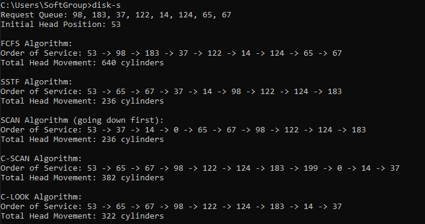

# Disk Scheduling Simulator (C++)

A robust C++ command-line application designed to simulate and analyze various **Disk Scheduling Algorithms** used by Operating Systems to manage Input/Output (I/O) requests for Hard Disk Drives (HDDs). 

The primary objective of these algorithms is to minimize the total head movement (seek time) of the disk arm when servicing I/O requests.

---

## Implemented Algorithms

This simulator provides clean and optimized implementations for the following standard algorithms:

1. **FCFS (First-Come, First-Served):** Services requests in the exact order they arrive, without optimizing for head movement.
2. **SSTF (Shortest Seek Time First):** Services the request closest to the current head position, significantly reducing total seek time but potentially causing starvation.
3. **SCAN (Elevator Algorithm):** The disk arm moves in one direction (configured here to go *down* first), servicing requests until it reaches the edge, then reverses direction to service the remaining requests.
4. **C-SCAN (Circular SCAN):** Moves from the current position to the end of the disk, servicing requests. Upon reaching the boundary, it instantly wraps around to the opposite end (cylinder 0) without servicing requests on the return trip.
5. **C-LOOK (Circular LOOK):** An enhanced version of C-SCAN. It only moves as far as the highest and lowest actual requests, avoiding unnecessary trips to the absolute disk boundaries (0 or 199).

---

## Sample Output 

Below is the actual terminal execution output demonstrating the performance and head movement calculations for each algorithm:

---

## Installation

git clone https://github.com/MariamAshraf25/disk-scheduling-algorithms.git

---

## Author

**Mariam Ashraf  **
 *Computer Engineering Student - Faculty of Engineering - Capital University (Formerly Helwan)*
[LinkedIn Profile](https://www.linkedin.com/in/mariam-ashraf-84415b2b8)
